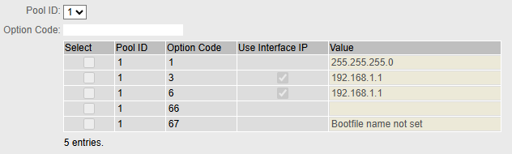
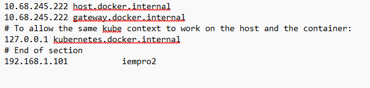

# IEM Pro Installation Guide med M876-4 Router

## Forudsætninger
- Debian 12 eller Ubuntu 22.04 LTS
- Minimum 8GB RAM, 16GB anbefalet
- 50GB+ disk space
- 4G router
- Ethernet forbindelse til 4G router

## 1. M876-4 Router Opsætning

### 1.1 VM Network Mode
```
VM Settings → Network:
- Adapter 1: Bridged Adapter
- Name: [Vælg dit ethernet interface til 4G routeren]
- VM får automatisk IP fra 4G routeren DHCP (192.168.1.101)
```
### 1.2 Initial Forbindelse
```bash
# Forbind ethernet kabel fra computer til M876-4
ping 192.168.1.1

```

### 1.3 Web Interface Adgang
```bash
# Åbn browser
https://192.168.1.1
# Login: check device label
```

### 1.4 Router Konfiguration
**Note:** 4G routeren skal være konfigureret med grundlæggende netværksindstillinger før denne guide bruges. Dette inkluderer IP adresse, DHCP server, og 4G forbindelse.

### 1.5 DNS Service Aktivering
```
System → DNS → DNS Records:
- Enable DNS Records: ✓
- Add Static Record:
  Domain: postgres.local
  IP Address: 192.168.1.101 (din VM IP)
```

## 2. VM Network Setup

### 2.1 Verificer Network Connectivity
```bash
# Check VM IP
ip addr show
# Burde vise: 192.168.1.101 (eller anden IP fra M876-4)

# Test M876-4 connectivity
ping 192.168.1.1

# Test DNS
nslookup postgres.local
# Burde returnere: 192.168.1.101
```

## 3. Database Setup på VM

### 3.1 Installer PostgreSQL
```bash
sudo apt update
sudo apt install postgresql postgresql-client
sudo systemctl start postgresql
sudo systemctl enable postgresql
```

### 3.2 Konfigurer Database
```bash
# Skift til postgres user
sudo -u postgres psql

# Opret database og user til IEM Pro
CREATE DATABASE iem_pro;
CREATE USER iem_user WITH PASSWORD 'SecurePassword123!';
GRANT ALL PRIVILEGES ON DATABASE iem_pro TO iem_user;
\q
```

### 3.3 Tillad Remote Forbindelser
```bash
# Find PostgreSQL version directory
ls /etc/postgresql/

# Rediger config (erstæt XX med din version)
sudo nano /etc/postgresql/XX/main/postgresql.conf
# Find og ændr: listen_addresses = '*'

sudo nano /etc/postgresql/XX/main/pg_hba.conf
# Tilføj nederst: host all all 192.168.1.0/24 md5

# Genstart PostgreSQL
sudo systemctl restart postgresql
```

### 3.4 Test Database
```bash
# Test lokal forbindelse
psql -h localhost -U iem_user -d iem_pro

# Test via router DNS - DNS navnet virker muligvis ikke, skift det ud med ip addressen i stedet for
psql -h postgres.local -U iem_user -d iem_pro
# Eller
psql -h 192.168.1.101 -U iem_user -d iem_pro

```

## 4. Installer k3s

```bash
curl -sfL https://get.k3s.io | sh -
```

Tjek at k3s kører:
```bash
sudo k3s kubectl get node
```

## 5. Konfigurer k3s

```bash
mkdir ~/.kube/
sudo cp -a /etc/rancher/k3s/k3s.yaml ~/.kube/config
sudo chown -R $USER $HOME/.kube
sudo chown -R $USER /etc/rancher/k3s/k3s.yaml
```

Test kubectl adgang:
```bash
kubectl get nodes
```

## 6. Installer Helm

```bash
curl -fsSL -o get_helm.sh https://raw.githubusercontent.com/helm/helm/main/scripts/get-helm-3
chmod 700 get_helm.sh
./get_helm.sh
```

## 7. Opret namespace og certificates

```bash
# Opret namespace
kubectl create namespace testlab
```

### 7.1 Generer Korrekte SSL Certificates

Opret certificate generation script og config filer:

EVT. læg filerne i en mappe og del med vm, istedet for at skrive det ind selv, kig på steppet under for at se hvordan.

**ca.conf:**
```conf
basicConstraints = CA:TRUE
keyUsage = cRLSign, keyCertSign
[req]
distinguished_name = req_distinguished_name
prompt = no

[req_distinguished_name]
C   = DE
ST  = Dummy
L   = Dummy
CN  = My Personal Root CA

```

**cert.conf:**
```conf
IEM = ""

[req]
default_md = sha512
basicConstraints=CA:FALSE
keyUsage = digitalSignature, nonRepudiation, keyEncipherment, dataEncipherment
default_keyfile    = myCert.key
x509_extensions    = v3_ca
prompt             = no
authorityKeyIdentifier=keyid,issuer
distinguished_name = req_distinguished_name
req_extensions     = req_ext


[req_distinguished_name]
C=DE
ST=Dummy
L=Dummy
O=Dummy
CN=localhost

[req_ext]
subjectAltName = @alt_names

[v3_ca]
subjectAltName = @alt_names

```

**cert-ext.conf:**
```conf
basicConstraints = CA:FALSE
nsCertType = server
nsComment = "My Certificate"
subjectKeyIdentifier = hash
authorityKeyIdentifier = keyid,issuer:always
keyUsage = nonRepudiation, digitalSignature, keyEncipherment
extendedKeyUsage = serverAuth
subjectAltName = @alt_names

```

**gen_with_ca_DNS.sh:**
```sh
#!/bin/bash

path=$(dirname "$0")

IEM_NAME=$1

mkdir -p "${path}"/out

openssl genrsa -out "${path}"/out/myCA.key 4096

openssl req -x509 -new -nodes -key "${path}"/out/myCA.key -sha256 -days 825 -out "${path}"/out/myCA.crt -config "${path}"/ca.conf

openssl genrsa -out "${path}"/out/myCert.key 4096

length=${#IEM_NAME}
if [ $length \> 63 ]
then 
    echo "WARNING: string too long for CN, will be adjusted"
    arrCN=(${IEM_NAME//./ })
    IEM_NAME_CN=*.${arrCN[-3]}.${arrCN[-2]}.${arrCN[-1]}
    echo "new CN $IEM_NAME_CN"
else 
    IEM_NAME_CN=$IEM_NAME
fi

openssl req -new -key "${path}"/out/myCert.key -out "${path}"/out/myCert.csr -subj "/C=DE/ST=Dummy/L=Dummy/O=Dummy/CN=$IEM_NAME_CN" -config <(cat "${path}"/cert.conf <(printf "\\n[alt_names]\\nDNS=%s" "${IEM_NAME}"))

openssl x509 -req -in "${path}"/out/myCert.csr -CA "${path}"/out/myCA.crt -CAkey "${path}"/out/myCA.key -CAcreateserial -out "${path}"/out/myCert.crt -days 825 -sha256 -extfile <(cat "${path}"/cert-ext.conf <(printf "\\n[alt_names]\\nDNS=%s" "${IEM_NAME}"))

cat "${path}"/out/myCert.crt "${path}"/out/myCA.crt > "${path}"/out/certChain.crt

rm "${path}"/out/myCert.csr "${path}"/out/myCA.srl
cp "${path}"/out/myCert.crt "${path}"/out/certChain.crt "$(pwd)"/


chmod +x gen_with_ca_DNS.sh
```

Generer certificates:
```bash
./gen_with_ca_DNS.sh dit-hostname

# Opret TLS secret
kubectl create secret -n testlab tls kongcert --key out/myCert.key --cert out/myCert.crt
```

## 8. Installer IEM Pro med Router Database

### 8.1. Hent nødvindige filer til installationen

Download IEM Pro mappen og IEM configuration .json fra IEHub og læg dem ind i VM.

Dette kan gøres ved at lægge dem i en mappe og så dele mappem med din VM.

Eftter at have delt mappem med VM, kør:
```bash
sudo apt update
sudo apt install virtualbox-guest-additions-iso virtualbox-guest-utils -y

sudo adduser $USER vboxsf

sudo reboot
```

Nu skulle mappen gerne ligge under:
```bash
ls /media/sf_* # Eller sf_<hvad din mappe hed>
```
For at kopier dem til hjemmemappen kør for begge:
```bash
cp /media/sf_*/configuration*.json ~/
```
og det samme med applicationen-management-service mappen.

Efter de ligger i hjemmemappen, skal du ændre ejerskab, kør for begge:

```bash
sudo chown $USER:$USER configuration*.json
```
Nu er du klar til IEM installation, brug enten scriptet, for iempro eller helm installationen neden under:


**VIGTIGT:** Denne konfiguration bruger PostgreSQL på VM via router DNS i stedet af intern database.

```bash
helm install iempro \
    --namespace testlab \
    --set-file global.activationConfig=configuration-<filnavn>.json \
    --set global.hostname=<dit-hostname> \
    --set global.storageClass=local-path \
    --set global.storageClassPg=local-path \
    --set global.gateway.ingress.enabled=false \
    --set global.certChain="$(cat ./out/certChain.crt | base64 -w 0)" \
    --set global.proxy.http_proxy='' \
    --set global.proxy.https_proxy='' \
    --set global.proxy.no_proxy='.svc\,.svc.cluster.local\,localhost\,127.0.0.1\,10.0.0.0/8\,172.16.0.0/12\,192.168.0.0/16\,POD_IP_RANGE\,SERVICE_IP_RANGE' \
    --set global.iemAdminPassword=Siemens1234! \
    --set global.customerAdminPassword=S13mens@PCT! \
    --set central-auth.keycloak.customerRealmAdmin.email=testlab@siemens.com \
    --set central-auth.keycloak.customerRealmAdmin.firstName=TEST \
    --set central-auth.keycloak.customerRealmAdmin.lastName=Lab \
    --set central-auth.keycloak.customerRealmAdmin.username=testlab \
    --set central-auth.keycloak.initialUser.email=iemuser@siemens.com \
    --set central-auth.keycloak.initialUser.enabled=true \
    --set central-auth.keycloak.initialUser.firstName=IEM \
    --set central-auth.keycloak.initialUser.lastName=User \
    --set central-auth.keycloak.initialUser.username=iemuser \
    --set kong.env.SSL_CERT=/etc/secrets/kongcert/tls.crt \
    --set kong.env.SSL_CERT_KEY=/etc/secrets/kongcert/tls.key \
    --set kong.secretVolumes[0]=kongcert \
    --set device-catalog.firmwaremanagement.enabled=true \
    --set device-catalog.workflowexecutor.enabled=true \
    --set postgresql.enabled=false \
    --set global.database.host=postgres.local \
    --set global.database.port=5432 \
    --set global.database.name=iem_pro \
    --set global.database.username=iem_user \
    --set global.database.password=SecurePassword123! \
    ./application-management-service-v1.14.9.tgz
```
### 8.2 Installation med Script

```bash
# Kopier scriptet over til home, og tilpas den så den passer til dig
# Gør scriptet executable
chmod +x install-iem-pro.sh

# Kør installation
./install-iem-pro.sh <configuration-myfile.json> <hostname> # iempro2

```

## 9. Overvåg installation

```bash
kubectl get pods -n testlab -w

watch kubectl get pods -n testlab
```
watch giver opdateringer hver 2. sekund

Vent til alle pods er `Running` eller `Completed`.

## 10. Tilføj DNS Record for IEM Hostname

**KRITISK:** Tilføj en separat DNS record for dit IEM hostname i routeren:

```
M876-4 Router → System → DNS → DNS Records:
- Add Static Record:
  Domain: dit-hostname
  IP Address: 192.168.1.101 (din VM IP)
```


Dette sikrer at edge devices kan resolve IEM hostname via router DNS.

## 11. Opret ingress.yaml for adgang med hostname
```yaml
apiVersion: networking.k8s.io/v1
kind: Ingress
metadata:
  name: iem-ingress
  namespace: testlab
  annotations:
    traefik.ingress.kubernetes.io/ssl-redirect: "true"
spec:
  ingressClassName: traefik
  rules:
  - host: dit-hostname
    http:
      paths:
      - path: /
        pathType: Prefix
        backend:
          service:
            name: iempro-gateway-proxy # Din xxx-gateway-proxy
            port:
              name: kong-proxy
```

Deploy ingress:
```bash
kubectl apply -f ingress.yaml
```

## 12. Konfigurer hostname

Tilføj hostname til /etc/hosts for lokal adgang på vm:
```bash
# brug din VM IP
echo "192.168.1.101 dit-hostname" | sudo tee -a /etc/hosts
```
hvis dette ikke virker:
```bash
sudo nano /etc/hosts
# tilføj din VM IP og hostname direkte inde på filen med nano
```

## 13. Adgang til IEM Pro

### 13.1 Find Traefik Port
```bash
kubectl get svc -n kube-system | grep traefik
```
Noter port nummeret (typisk 30xxx).

### 13.2 Lokal Adgang
```bash
# Access med hostname
https://dit-hostname

# Eller access med hostname og port
https://dit-hostname:30xxx

# Eller med port forward
kubectl port-forward svc/iempro-gateway-proxy -n testlab 8080:80
# Derefter: http://localhost:8080
```

## 14. Edge Device Onboarding

### 14.1 Download Device Configuration

1. Gå til IEM Pro web interface (`https://dit-hostname`)
2. Log ind med admin credentials
3. Gå til **Device Management** → **Devices**
4. Klik **"Create Device"**
5. Udfuld de nødvendige informationer
5. Download **device configuration JSON fil**

### 14.2 Konfigurer Edge Device Network

På Industrial Edge device (f.eks. IPC127E):

**Netværkskonfiguration:**
Network Settings:
1. Start med at gå ind i DHCPv4, og vælg DHCP Server og disable den
2. Gå derefter ind på DHCP Options og ændre google (8.8.8.8), til at bruge din router ip, det skal gerne se nogenlunde sådan ud 
3. Efter det er ændret og gemt, enable nu DHCP Serveren igen og gem.

### 14.3 Device Activation Process

1. **Åbn Industrial Edge Runtime:**
   ```
   Browser på edge device: https://[device-ip]
   ```

2. **Upload Configuration:**
   - Klik **"Browse"** under "Device config file"
   - Upload den JSON fil downloadet fra IEM Pro
   
3. **Start Activation:**
   - Klik **"Activate"**
   - Device vil automatisk connecte til IEM serveren
   - Vent på "Device successfully activated" besked
   - Når den er slut refresh siden og vent på der kommer et loggin

### 14.4 Verificer Device Connection

**I IEM Pro portal:**
1. Gå til **Device Management** → **Devices**
2. Find din edge device i listen
3. Status skal vise **"Connected"** eller **"Online"**


### 14.5 Troubleshooting Device Onboarding

**Hvis "Unable to connect to IEM" fejl:**

1. **Test DNS resolution på edge device:**
   ```cmd
   nslookup dit-hostname
   # Skal returnere 192.168.1.101
   ```
   Dette step kan godt drille, men så prøv at ændre dns domain til dit-hostname.local, og kør den igen med det og se om det virker, hvis det virker så det rigtigt

2. **Test network connectivity:**
   ```cmd
   ping dit-hostname
   ```

3. **Manual hosts file (hvis DNS fejler):**
   ```
   Windows + r: C:\Windows\System32\drivers\etc\hosts
   Ubuntu: /etc/hosts
   
   Tilføj: 192.168.1.101    dit-hostname
   ```
   Kør notepad som adminstrator og tilføj din VM ip addresse og hostname.
   

**Hvis certificate fejl:**
- Sørg for at device config JSON indeholder korrekte certificates
- Tjek at IEM Pro bruger de korrekt genererede certificates
- Hvis du selv har lavet dem med openssl skal de slettes og de kør scriptet, se længere oppe for hvordan


## 15. Udvid Traefik timout

Timeout konfigurationen er ikke nødvendigt at have indtil man har de omkring 50-100+ edge devices.

Opret traefik-config.yaml
```yaml
apiVersion: helm.cattle.io/v1
kind: HelmChartConfig
metadata:
  name: traefik
  namespace: kube-system
spec:
  valuesContent: |-
    additionalArguments:
      - "--entryPoints.web.transport.respondingTimeouts.readTimeout=3600s"
      - "--entryPoints.web.transport.respondingTimeouts.writeTimeout=3600s"
      - "--entryPoints.web.transport.respondingTimeouts.idleTimeout=3600s"
      - "--entryPoints.websecure.transport.respondingTimeouts.readTimeout=3600s"
      - "--entryPoints.websecure.transport.respondingTimeouts.writeTimeout=3600s"
      - "--entryPoints.websecure.transport.respondingTimeouts.idleTimeout=3600s"
```
Gem om og apply den derefter:

```bash
kubectl apply -f traefik-config.yaml
```

## 16. Velero Backup

### 16.1 Download og installer Velero CLI

```bash
# Download latest Velero release
VELERO_VERSION=v1.12.0
wget https://github.com/vmware-tanzu/velero/releases/download/${VELERO_VERSION}/velero-${VELERO_VERSION}-linux-amd64.tar.gz

# Extract og installer
tar -xvf velero-${VELERO_VERSION}-linux-amd64.tar.gz
sudo mv velero-${VELERO_VERSION}-linux-amd64/velero /usr/local/bin/

# Verificer installation
velero version --client-only
```

### 16.2 Opret backup storage directory

```bash
# Opret backup directory på VM
sudo mkdir -p /backup/velero
sudo chown -R $USER:$USER /backup/velero

# Verificer space
df -h /backup
```

### 16.3 Installere MinIO

```bash
# Opret MinIO namespace
kubectl create namespace velero

# Opret en Minio-deployment.yaml
nano minio-deployment.yaml

# Og indsæt dette
```

```yaml
apiVersion: apps/v1
kind: Deployment
metadata:
  namespace: velero
  name: minio
  labels:
    component: minio
spec:
  strategy:
    type: Recreate
  selector:
    matchLabels:
      component: minio
  template:
    metadata:
      labels:
        component: minio
    spec:
      volumes:
      - name: storage
        hostPath:
          path: "/backup/velero"
          type: DirectoryOrCreate
      containers:
      - name: minio
        image: minio/minio:latest
        imagePullPolicy: IfNotPresent
        args:
        - server
        - /storage
        - --config-dir=/config
        - --console-address=:9001
        env:
        - name: MINIO_ACCESS_KEY
          value: "minio"
        - name: MINIO_SECRET_KEY
          value: "minio123"
        ports:
        - containerPort: 9000
        - containerPort: 9001
        volumeMounts:
        - name: storage
          mountPath: "/storage"
---
apiVersion: v1
kind: Service
metadata:
  namespace: velero
  name: minio
  labels:
    component: minio
spec:
  type: NodePort
  ports:
    - name: api
      port: 9000
      targetPort: 9000
    - name: console
      port: 9001
      targetPort: 9001
  selector:
    component: minio
```

```bash
# Deploy MinIO
kubectl apply -f minio-deployment.yaml
```

### 16.4 Opret MinIO bucket

```bash
# Port forward til MinIO console
kubectl port-forward -n velero svc/minio 9001:9001 &

# Gå til http://localhost:9001
# Login: minio / minio123
# Opret bucket: "velero"

```

### 16.5 Opret credentials fil

```bash
# Opretter en credentials-velero fil til login
cat > credentials-velero << EOF
[default]
aws_access_key_id = minio
aws_secret_access_key = minio123
EOF
```

### 16.6 Installer Velero med MinIO backend
```bash
velero install \
    --provider aws \
    --plugins velero/velero-plugin-for-aws:v1.8.0 \
    --bucket velero \
    --secret-file ./credentials-velero \
    --use-volume-snapshots=false \
    --use-node-agent \
    --backup-location-config region=minio,s3ForcePathStyle="true",s3Url=http://minio.velero.svc.cluster.local:9000
```

### 16.7 Verificer Velero installation
```bash
# Tjek at Velero pods kører
kubectl get pods -n velero

# Tjek backup location
velero backup-location get
```

### 16.8 Annotate volumes for backup
```bash
# Find volumes der skal backes up
kubectl get pv

# Annotate PVCs i testlab namespace
kubectl annotate pvc -n testlab --all backup.velero.io/backup-volumes=true
```

### 16.9 Opret øjeblikkelig backup
```bash
# Fuld backup af IEM Pro namespace
velero backup create iem-pro-backup-$(date +%Y%m%d-%H%M) \
    --include-namespaces testlab \
    --default-volumes-to-fs-backup \
    --wait

# Overvåg backup status

# List alle backups
velero backup get

# Detaljer om specifik backup
velero backup describe iem-pro-backup-20250909-1430

# Backup logs (kan først køres når backup er færdig)
velero backup logs iem-pro-backup-20250909-1430
```

### 16.10 Restore Operations
```bash
# Se mulige backups
velero backup get

# Restore fra backup
velero restore create iem-pro-restore-$(date +%Y%m%d-%H%M) \
    --from-backup iem-pro-backup-20250909-1430 \ 
    --wait

# Verificer restore
kubectl get pods -n testlab

```

### 16.11 Opret backup schedule

```bash
# Daglig backup kl. 02:00
velero schedule create iem-pro-daily \
    --schedule="0 2 * * *" \
    --include-namespaces testlab \
    --default-volumes-to-fs-backup

# Ugentlig fuld backup (inkl. cluster metadata)
velero schedule create iem-pro-weekly \
    --schedule="0 3 * * 0" \
    --include-namespaces testlab \
    --include-cluster-resources=true \
    --default-volumes-to-fs-backup

```

## 17. Troubleshooting

### Database Connectivity
```bash
# Test router DNS
nslookup postgres.local

# Test database forbindelse
psql -h postgres.local -U iem_user -d iem_pro

# Check PostgreSQL status
sudo systemctl status postgresql
```

### Network Issues
```bash
# Test M876-4 connectivity
ping 192.168.1.1

# Check VM IP
ip addr show

# Test ingress
kubectl describe ingress iem-ingress -n testlab
```

### Router Management
```bash
curl http://192.168.1.1

# Check router status
ping 192.168.1.1
```

### Pods Unknown eller CrashLoopBackOff efter restart af VM

De fleste pods skulle meget gerne begynde at være Running efter lidt tid, hvis iempro-gateway-proxy eller andre pods forsætter med at være i et loop med crash og running, så kør:
```bash
kubectl delete pod <pod-navn> -n testlab
```
Så skulle den meget gerne være running efter

Alt. kan man undersøge hvorfor en pod fejler med:

```bash
kubectl describe pod <pod-navn> -n testlab
```
eller
```bash
kubectl logs <pod-navn> -n testlab
```


### Problem med at tilgå siden efter genstart (Ip ændret)

1. Undersøg om VM's IP er blevet ændret med "ip a", (Test på host terminal, om det er muligt at pinge til den gamle IP, og derefter tjek med den nye IP)
2. Åben " sudo nano /etc/hosts" og ændre den gamle ip til den nye ip på VM
3. Åben gør det samme på Host pc, ved at trykke på "windows + r" og skriv "notepad C:\Windows\System32\drivers\etc\hosts", og ændre den gamle IP til den nye VM's IP, sørg for at der er administrator adgang, evt. åben den som notepad som administrator.
4. Efter det ændre dns instillingerne på 4G routeren inde under DNS Records, og ændre de gamle IP'er til den nye IP
5. Nu skulle du gerne kunne åbne siden igen med hostnavnet eks. iempro2

Forklaring

Dette sker efter man har ændret DHCP range fra 192.168.1.100 i lower IP Address til 192.168.1.150. Dette betyder at den lave en ny IP til din VM indenfor 192.168.1.150 - 192.168.1.200.

Det er muligt at lave en fast IP inde under DHCP/static leases, det bør gøres, så man er sikker på man altid får den samme IP.

### OnPremise pods fejler

- Dette er muligvis fordi der er blevet ændret på ip addressen, undersøg og se hvilken ip du bruger og om det er den samme der altid er blevet brugt
- Hvis dette er tilfældet at den er blevet skiftet, skal der lavet en hel ny helm installation af IEM pro.
- Sørg for at få en static ip addresse så dette ikke sker igen

### Tilgår applicationen UI og kommer ind i Lanchpad istedet for login

- Mulig fejl er at gateway-proxy ikke er færdig, vent eller delete dens pod så den køre igen
- Undersøg med browser console og se om du får mange 401 og 502 fejl - authentication og service communication fejler
  - Problemet er Keycloak der ikke fungere korrekt med frontend
  - Kig på logs for keycloak
  - Hvis du får: Non-secure context detected; cookies are not secured, and will not be available in cross-origin POST requests
  - Løsning: delete keycloak poden og vent til den er oppe og køre og så vent nogle minutter, så skulle det gerne virke efter

### Certificate Download Issues

Hvis certificate download fra IEM Pro fejler med 500 fejl:
```bash
# Tjek portal service logs
kubectl logs portal-service-0 -n testlab
# Den kan godt sige noget med Illegal base64 character, dette betyder at certification ikke er godkendt, slet den gamle og se hvordan man lavet et rigtigt certificat ovenover

# Helm upgrade med de nye certificates
helm upgrade iempro \
    --namespace testlab \
    --reuse-values \
    --set global.certChain="$(cat out/certChain.crt | base64 -w 0)" \
    --set kong.env.SSL_CERT=/etc/secrets/kongcert/tls.crt \
    --set kong.env.SSL_CERT_KEY=/etc/secrets/kongcert/tls.key \
    --set kong.secretVolumes[0]=kongcert \
    ./application-management-service-v1.14.9.tgz

# Restart portal service og din gateway-proxy hvis nødvendigt eller efter at have lavet en ny certificat
kubectl delete pod portal-service-0 -n testlab
kubectl delete pod <gateway-proxy> -n testlab

```


## Success kriterier

- M876-4 router fungerer som DHCP og DNS server
- VM får IP fra M876-4 (192.168.1.101)
- PostgreSQL tilgængelig via postgres.local
- DNS record for IEM hostname fungerer
- Alle IEM Pro pods `Running` eller `Completed`
- Web interface tilgængeligt via hostname
- Edge devices kan onboardes og vise "Connected" status

## Login credentials

**Login credentials**

**URL:** `https://dit-hostname`
**Standard bruger:** `iemuser` / `Siemens1234!`

**Admin bruger:** `testlab` / `S13mens@PCT!`
